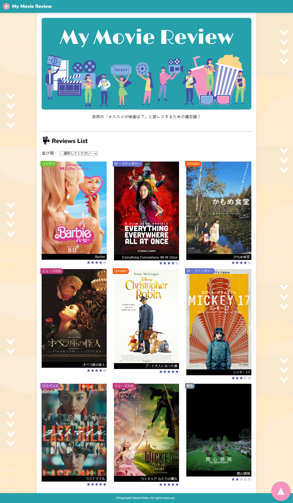
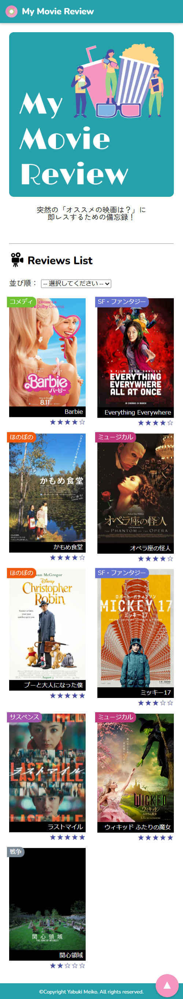

# アプリ名「マイレビューアプリ」

## スクリーンショット

起動後のトップ画面：

## 制作の経緯

このアプリは、職業訓練校での学習の一環として制作しました。  
JavaやSpring Boot、PostgreSQLといった技術を実践的に使いながら、  
日々観た映画を記録・管理するためのシンプルなレビューアプリを目指しています。
内部機能は学習時にテスト制作したものを土台に、html、css、javascriptを充実させてアップデートした仕様です。

このアプリの計画の発端は「おすすめの映画ある？」にすぐ答えたい自らの希望でした。
何観たっけ？どういう感想だったっけ？など、自身の記憶を留めておける備忘録として計画しました。
あわよくば、このアプリを開いて見せながら会話が弾むような場面が生まれると嬉しいです。

## 機能説明

- 映画のタイトル、ジャンル、公開年、評価、あらすじ、レビューを登録可能
- 映画ごとに画像（ポスターなど）をアップロード
- 一覧表示、詳細表示、編集、削除の基本機能を搭載
- Thymeleafを用いた画面構成とデータバインディング
- 登録日時・更新日時の自動記録

## 今後追加したい機能

- ソート機能の充実（ジャンル別、公開年を絞るなど）
- 映画観賞日時の登録（不明な場合の処理など未検討のため）
- 複数の管理者ごとにDBを構築できるようにする（現在は登録・編集権限を持つadminと、閲覧のみの権限を持つuser）
